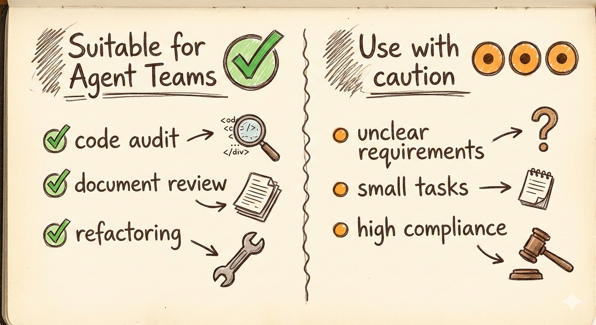

# Claude agent teams 功能介绍与思考（未实测版）

## 我们为什么先写这篇“入门导航”
还没来得及实测，但功能窗口已经打开。先把关键信息捋清：agent teams 是什么、怎么开启、成本/限制在哪，以及第一次尝试要盯哪些点；实测后再补充。

## 功能速览：agent teams 是什么
- 出处：Opus 4.6（2026-02-05）随 Claude Code/API 更新发布，定位“研究预览”。
- 核心卖点：多个子代理并行、主代理协调；支持 1M-token 上下文，适合整仓代码/多文档。
- 预期收益：自动拆分并行执行长任务，减少人工拆解与等待。

## 工作方式（原理线索）
- 角色分工：主代理拆任务并生成共享待办；子代理各自有上下文，可互聊并同步进度。
- 与旧版 sub-agent 的差异：从单向回传升级为多向交流+依赖解锁，更像“小团队”协同。
- 长上下文：1M tokens 允许“全仓代码+需求+设计”放在同一会话内，但 token 成本同步抬升。

## 使用条件与开启方式
- 入口：Claude Code（桌面/云）与 API。
- 开关：显式打开实验变量 `CLAUDE_CODE_EXPERIMENTAL_AGENT_TEAMS=1`（shell 或 settings.json）。
- 账号：Team/企业用户优先；个人订阅需看控制台是否提供实验开关。
- 建议：先在低风险仓库试开；记录开关位置与日志路径，方便回滚。

## 成本与限制
- 计费：并行子代理的输入/输出 token 累加；1M context 属高价档位（基准 $5/百万输入、$25/百万输出，超大档到 $10/$37.5）。
- 稳定性：研究预览，可能拆分偏移、超时或质量波动；首轮拆分和关键决策需人工盯。
- 协调风险：主代理拆得不佳会放大浪费；子代理可能重复或跑偏。

## 适合的任务类型
- 可并行的代码/文档工作：安全、性能、测试多视角审计；跨模块重构；多文档综述/对照。
- 高上下文长链路：整仓迁移、法规/财报并行解读、跨产品比较。
- 需要角色分工的任务：让子代理分别扮演“审计”“总结”“反例”“对照”等角色。

## 不适合或需谨慎的场景
- 需求模糊、无法清晰拆分的探索式任务。
- 高合规/强一致性且缺少人工把关的场景。
- 极短小任务：调度开销可能高于收益。

## 首次尝试的最小方案
- 配置：先开 2–3 个子代理；设定 token 上限和最大并行数；保留一键回退到单代理的预案。
- 流程：
  1) 让主代理展示拆分方案；
  2) 人工快速确认/微调；
  3) 再放行子代理并行；
  4) 关键节点插入人工提示，避免跑偏。
- 观察点：
  - 拆分是否合理、是否重复/冲突；
  - 子代理沟通是否偏题；
  - 时间节省 vs token 花费（记录具体任务的耗时与账单）。

## 开放问题与后续观察
- 协调质量的上限：子代理数量与任务难度的平衡点？
- 与“Summarize from here”/自动记忆等新控件的配合效果，是否能降低遗忘。
- Fast Mode（加速推理）在 agent teams 场景的性价比；是否值得常开。
- 何时由人指定角色更好，何时让主代理自定更高效。

## 结尾
这篇只是功能与原理线索的梳理，不含实测结果。等真实项目里跑过再补充案例、成本曲线和常见故障排查。
