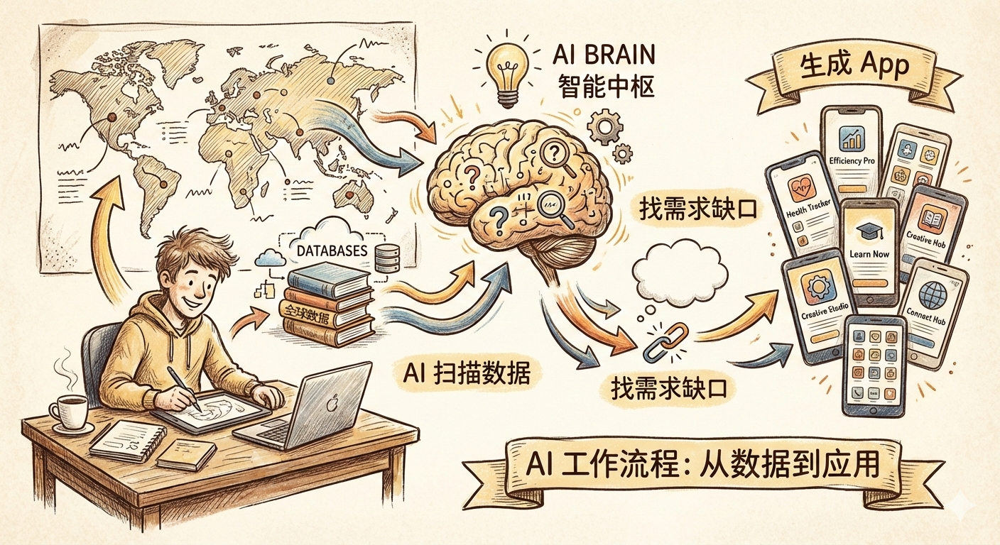
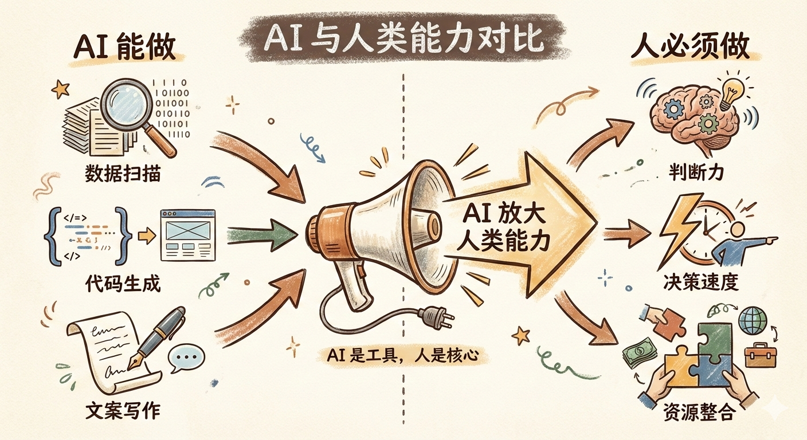

# 发布包：一人 AI 工厂实战复盘

## 文章信息

**源文件**: `content/drafts/2026-02-16-yupi-ai-factory.md`
**发布日期**: 2026-02-16

---

## 标题选项

| 选项 | 标题 |
|------|------|
| A (推荐) | 程序员鱼皮「一人 AI 工厂」实战复盘：他的方法能复制吗？ |
| B | 5 个月 120+ App：一人 AI 工厂的可复制与不可复制 |
| C | AI 是放大器，不是替代品：从 120+ App 案例看人机边界 |

---

## 摘要 (2-4 句话)

程序员鱼皮靠一套可复刻的 AI 工作流，5 个月上线 120+ App。核心是 Prompt 工程 + 选品思路 + 快速迭代。AI 是放大器不是替代品——你的判断力越强，AI 帮你放大的效果越好。

---

## 关键要点 (3-5 点)

- **Prompt 工程本质**：把行业判断力翻译成机器能理解的语言
- **AI 能做的**：数据扫描、代码生成、文案撰写、A/B 测试辅助
- **AI 做不了的**：行业直觉、判断力、决策速度、资源整合
- **可复制部分**：工作流思路、快速迭代、最小验证
- **无法复制变量**：执行速度、行业积累、时机运气

---

## 所需素材

### 图片文件
- **封面图**: `cover-image/yupi-ai-factory/cover.png`
- **插图 1**: `illustrations/yupi-ai-factory/illustration-ai-workflow.png` (AI 工作流)
- **插图 2**: `illustrations/yupi-ai-factory/illustration-ai-boundary.png` (AI 边界)

### 外部链接
- 程序员鱼皮 X: https://x.com/yupi996/status/2022524431638368443

---

## 发布检查清单

### 发布前
- [ ] 确认标题选项，选择最终标题
- [ ] 上传封面图到公众号素材库
- [ ] 上传插图 1、2 到公众号素材库
- [ ] 在草稿箱中设置封面图（从素材库选择）

### 发布时
- [ ] 将摘要插入文章顶部（可选）
- [ ] 检查插图位置和大小
- [ ] 检查排版和格式
- [ ] 预览确认无误

### 发布后
- [ ] 更新 `content/ideas/2026-02-15-yupi-120-apps.md` 标记为「已发布」
- [ ] 将草稿移动到 `content/published/` 目录
- [ ] 从 `content/ideas/backlog.md` 移除此选题

---

## 文章正文

(以下内容可直接复制到公众号编辑器)

---

# 程序员鱼皮「一人 AI 工厂」实战复盘：他的方法能复制吗？

## 一、开篇：120+ App 的冲击力

5 个月，120+ App，90% 付费率。

看到这个数字的时候，我的第一反应是：是不是吹牛？

仔细看了他的 Twitter 和相关报道后发现，这不是概念验证，而是真实跑出来的数据。一个程序员，靠一套可复刻的 AI 工作流，确实在短时间内完成了这么多产品。

我的好奇心一下子就被点燃了：**一个人怎么能干这么多事？他的方法，能不能复制？**

带着这个问题，我开始拆解。

---

## 二、拆解：三大件

### 1. Prompt 工程：怎么让 AI 找需求？

核心思路是：用 AI 扫描全球各行业的公开数据，找「有人需要但没人做」的应用缺口。

这听起来简单，但关键在于 Prompt 的设计。

你需要让 AI 理解：
- 什么算「需求」？
- 什么算「没人做」？
- 怎么判断有没有付费意愿？

这不是一次 Prompt 能搞定的事，而是需要多轮调教、不断优化的过程。**Prompt 工程的本质，是把你的行业判断力翻译成机器能理解的语言。**

### 2. 选品思路：判断力才是核心竞争力

Prompt 能帮你找到潜在需求，但**判断这个需求是否值得做**，依然需要人的经验。

鱼皮的选品逻辑大概是：
- 需求真实存在（不是伪需求）
- 现有解决方案不够好（有改进空间）
- 付费意愿可验证（能接到广告或付费）

这三条，每一条都需要行业积累。AI 可以帮你筛选，但最终拍板的还是人。

### 3. 快速迭代：小步快跑背后的逻辑

120+ App 意味着，平均每天接近 1 个。

这不是因为 AI 能替你写代码——代码生成只是整个环节的一小部分。真正的关键在于：

- **最小可行性验证**：一个 App 只需要验证核心功能，不需要完美
- **快速试错**：这个不行就换下一个，不纠结
- **复用积累**：每个 App 的经验都能沉淀到下一轮

说白了，就是**用数量换概率**。100 个里只要有 10 个成功，就能覆盖成本。

---

## 三、分析：AI 介入的边界

拆解完三大件，我最想知道的其实是：**AI 到底能帮我做什么、不能做什么？**

**AI 能做的**：数据扫描、代码生成、文案撰写、A/B 测试辅助

**AI 做不了的**：行业直觉、判断力、决策速度、资源整合

这给我的启发是：**AI 是放大器，不是替代品。** 你的判断力越强，AI 帮你放大的效果越好。如果你没有判断力，AI 帮你跑得越快，可能偏得越远。

---

## 四、我的小实验

光分析不过瘾，我决定亲自跑一遍。

选题：本地服务领域（家政、维修、搬家等）

我的思路是：
1. 用 AI 扫描大众点评、58 同城等平台的数据
2. 找「需求多但评价差」或「供给不足」的品类
3. 验证是否有创业机会

结果怎么样？

**过程**：Prompt 调试花了我大概 2 小时，让 AI 理解「什么是好的本地服务」这件事，比想象中复杂。

**发现**：
- AI 能找到一些明显的痛点（比如某个品类评分普遍低）
- 但**判断这个痛点是否够痛、是否有人愿意付费**，AI 给不出有把握的答案
- 本地服务重线下交付，AI 能帮你发现需求，但无法验证执行难度

**结论**：跑了一遍之后，我对这个方向的判断更清楚了——可以做，但需要线下资源配合，纯线上搞不定。

这个验证过程本身，就是最大的收获。

---

## 五、结论：可复制 vs 无法复制

回到最初的问题：鱼皮的方法能复制吗？

**可以复制的部分**：
- 用 AI 扫描数据找需求的工作流
- 快速迭代、最小验证的思路
- 不纠结、发现问题立即切换的心态

**无法复制的变量**：
- 行业积累带来的判断力
- 执行速度和精力（5 个月 120 个 App，需要极高强度）
- 起步阶段的流量和资源
- 时机和运气

**对普通开发者的启发**：

1. **不要纠结于「复制模式」，而是理解背后的思路**
   工作流可以学，但判断力需要时间积累。

2. **从小处验证，先跑通一个闭环**
   不需要一开始就搞 120 个 App，先跑通 1 个、2 个，看看自己适不适合这条路。

3. **把 AI 当放大器，而不是替代品**
   你的能力越强，AI 帮你放大的效果越好。先提升自己，再用 AI 加成。

---

## 尾巴

写这篇文章的过程，其实也是一次小实验——验证了一个假设：看别人的成功案例，不能光看结果，要拆解工作流，理解哪些能学、哪些不能学。

鱼皮的案例给我最大的启发，不是「AI 能帮你做多少」，而是「你有多少判断力，AI 就能帮你放大多少」。

如果你对这个方向感兴趣，不妨自己跑一遍。不用多，1-2 个小实验，就能验证很多假设。

**如果你跑过了，欢迎分享你的发现。**
